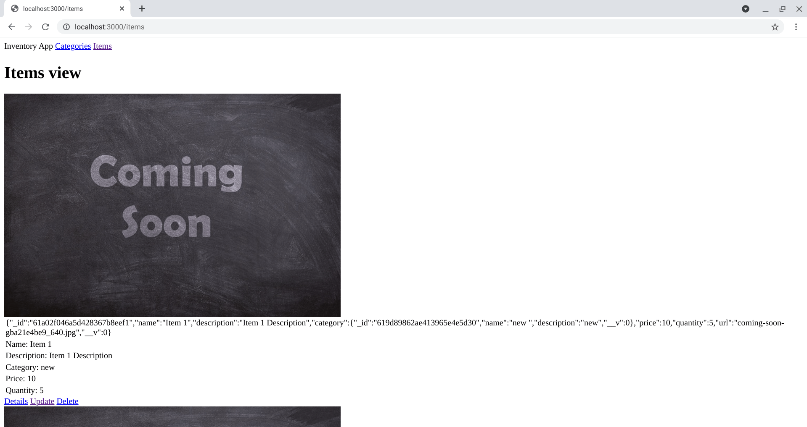
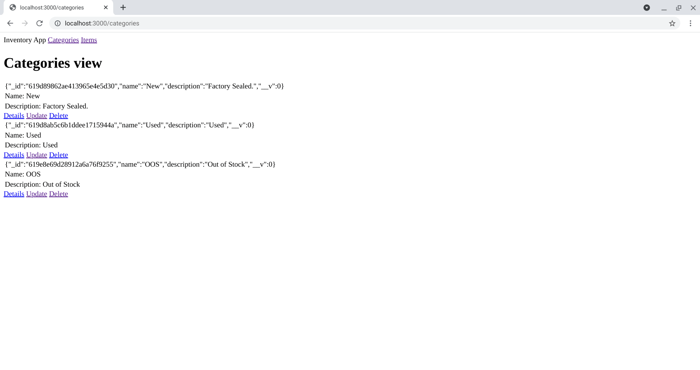
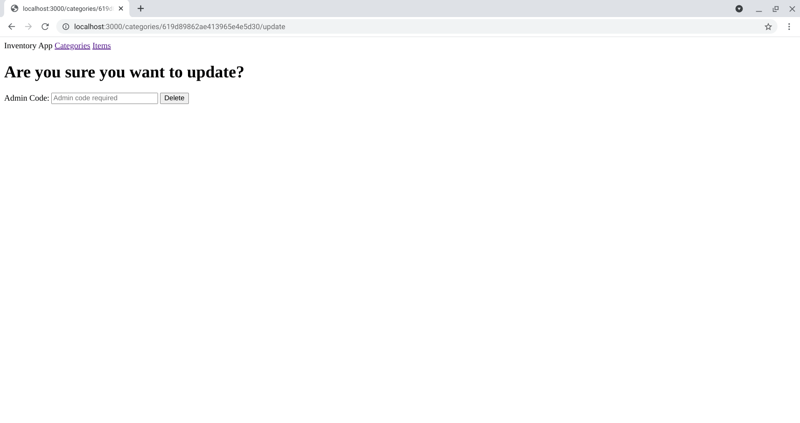

<h1 align="center">Inventory Application</h1>

   Solution for a challenge from  <a href="https://www.theodinproject.com/paths/full-stack-javascript/courses/nodejs/lessons/inventory-application" target="_blank">theodinproject.com</a>.

## Table of Contents

- [Overview](#overview)
  - [Built With](#built-with)
  - [Thoughts](#thoughts)
- [Features](#features)
- [Improvements](#improvements)
- [Useful Resources](#useful-resources)

## Overview

### Built With

- Express Generator
- Multer
- EJS
- Mongoose

- To run, git clone and add a MONGO Connection string.  
- The update and delete passwords are 'update' and 'delete'.

### Thoughts

- Have to make sure you have the forward slash inside the action on the form element.  Otherwise, route will be appended to back of exisiting url.
- Redirect('/') always goes to the first route you define. Not specific to route file.  
- All variables you define and pass to a template belong to a locals object.  
- fs.unlink() helps you remove local files.  Nice touch to get rid of user uploaded images when deleting an item.    

## Features

The [challenge](https://www.theodinproject.com/paths/full-stack-javascript/courses/nodejs/lessons/inventory-application) was to create an Inventory management app for an imaginary store including all of the CRUD methods for both items and categories.

## Improvements

- In my implementation, categories have to be defined before items. Otherwise, view will fail to display. 
- Left in stringified object in view for easier debugging and grabbing of ids. 
- Wanted to use placeholder to display item properties in ejs template and accordingly passed data to template, only to have difficulty getting the exact syntax necessary to achieve it.  Not much help from Stack Overflow there. Switching to <%- %> didn't help either. 
- Categories do not have images - doesn't seem really necessary.    
- Styling
- Authentication
- Tests
- Error handling
- File Structure i.e. controllers folder and refactoring routes file

### Resources

- [Reddit](https://www.reddit.com/r/node/comments/llwi51/mongoose_how_can_i_update_multiple_fields_in_one/) - Mongoose update multiple fields
- [Stack Overflow](https://stackoverflow.com/questions/52221415/cant-show-data-using-ejs-inside-placeholder) - ejs placeholder 
- [Stack Overflow](https://stackoverflow.com/questions/34697502/how-to-limit-the-file-size-when-uploading-with-multer) - Multer
- [Pixabay](https://pixabay.com/photos/coming-soon-chalk-board-blackboard-2550190/) - Coming Soon Image taken from here
- [Stack Overflow](https://stackoverflow.com/questions/49650458/image-uploading-platform-using-node-js-mongoose-and-multer) - multer
- [Stack Overflow](https://stackoverflow.com/questions/49099744/nodejs-multer-diskstorage-to-delete-file-after-saving-to-disk) - multer method to delete file?
- [Geeks For Geeks](https://www.geeksforgeeks.org/node-js-fs-unlink-method/) - FS Unlink to remove uploaded image on delete
- [Express](https://expressjs.com/en/resources/middleware/multer.html) - Multer Docs
- [Stack Overflow](https://stackoverflow.com/questions/5404830/node-js-ejs-including-a-partial) - Partials in EJS